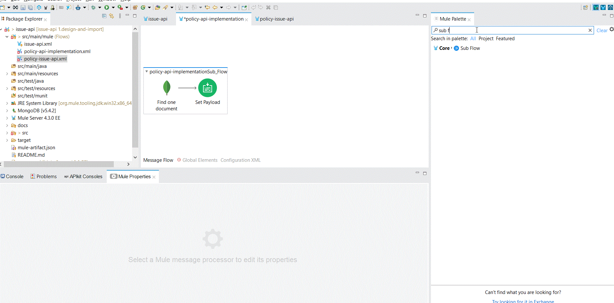
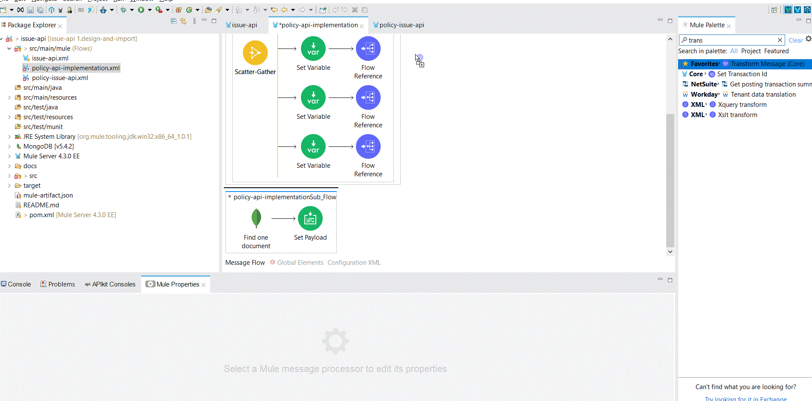
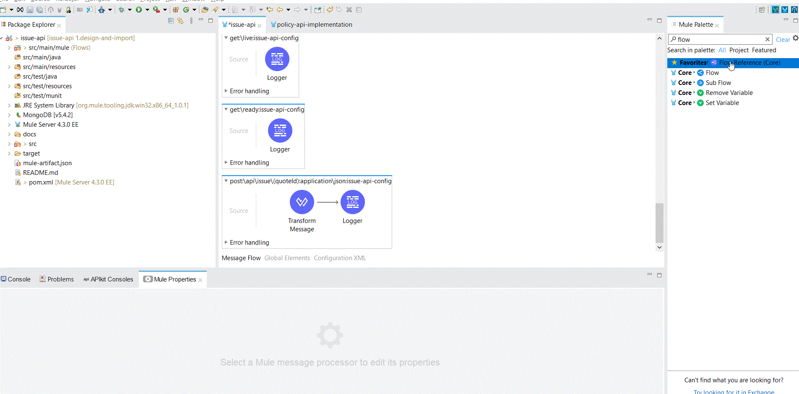
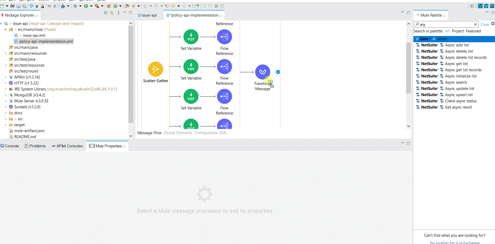
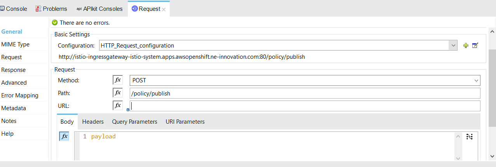
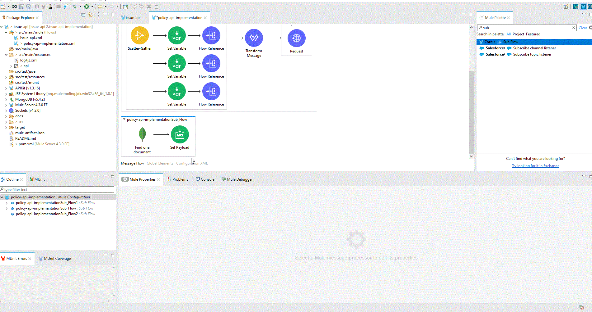
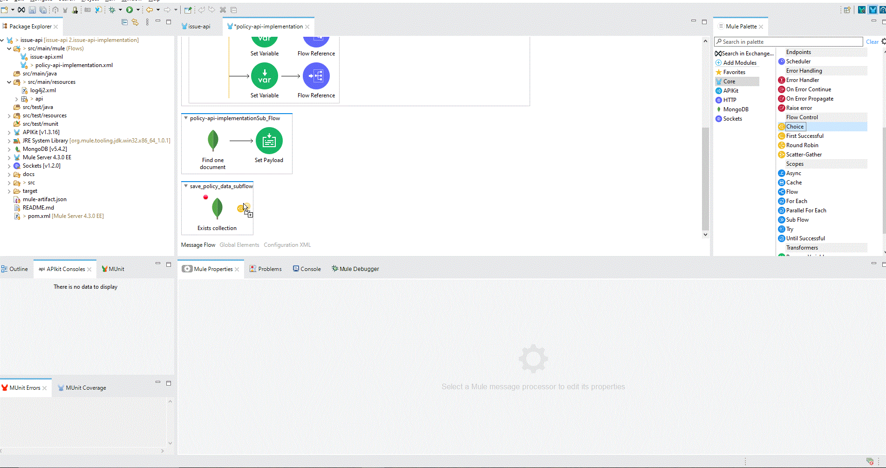
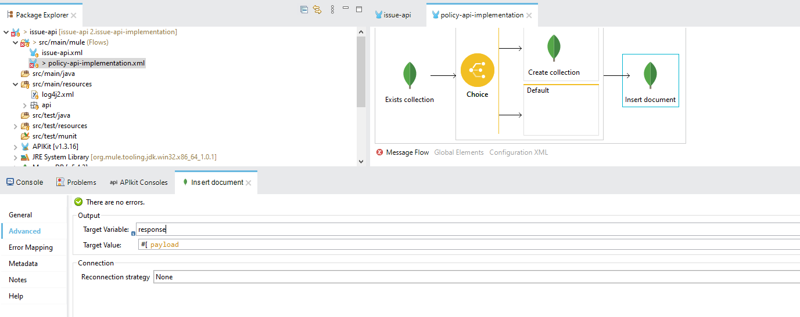

# Issue -API Implementation
## Post Operation Implementation

1. Checkout the issue-api repository from Git <https://github.com/ANE-UCD-MULESOFT-TRAINING/issue-api> and branch 1.design-and-import. 
  This would get the base code to start the development for this exercise. 
  Import the project into Anypoint Studio by selecting import project, Anypoint studio project. This would open the Mule Project inanypoint studio. 
  Once the project is open, Run the project to check if it loads correctly. This step should download all the dependencies required as well. 
  
  
2. Once the build is complete and you validate that the app is loading correctly, lets perform the next step of adding the modules required for this project. Lets start with       
    importing Mongo DB connector. 
    To do this click on the exchange button 
    Log into anypoint exchange if prompted for login.
    Select Provided by MuleSoft on the left side bar and search for mongodb.
    For this exercise we will use the MongoDB Mule 4 Connector. Now lets select the version 5.4 for this lab exercise.
    Click on Add to project and the connector should be added to the project and you should be able to see that in the Mule Palette.
    
    
3. Now that the dependency is added, lets get started with implementing the Post Issue method. For this we will be reading data from 5 collections (col_lrqi_drivers,   
    col_lrqi_vehicles, col_lrqi_customers, col_lrqi_rate_issue &, col_lrqi_incidents).
    So lets start first by writing the connection to mongodb to fetch data.
    Lets create a new Mule configuration file and name it as policy-api-implementation. We will write all the logic in this file so as to not put lot of logic in one configuration file. Now lets add the first component in this file. From the mule palette add the sub flow component. Inside the sub flow component lets add a mongodb component 'Find one document'.


4. Now that we have added the mongo db component, lets specify the mongo connection string. Click on Add new connector config and select mongo db connection string and provide the connection string. Click on Test connection to validate the connection to mongo is successful.


5. Now lets configure the Find One document. Lets update the collection name to retreive from variable and set it as 
    ```ruby
    vars.query.collectionName
    ```
    also lets update the find query as 
    ```ruby
    vars.query.searchParam
    ```


6.  Next lets add a set payload component to the flow after the find one document to save the output from the mongo as Json.
      ```
      %dw 2.0
    output application/json
    ---
    payload
      ```

    
 7. Now we are set with the sub flow to connect to mongo DB. Let us create another subflow which will be orchestrating the calls to the mongo db component. For this we will need to connect to 5 different collections, which can be done in parallel and we need not do that sequentially. So lets add another sub flow to policy-api-implementation.xml and in this we will add a scather gather component which would run all the branches of this component in parallel.
  The scather gather will hold two components one would be the set variable and another a flow reference to invoke the mongo connection subflow.


8. Inside the set variable component add the following  
  ```
  output application/json
    ---
    {
      searchParam : {
        quoteId: vars.quoteId
      },
      collectionName: "col_lrqi_drivers"
    }
  ```


 9. Repeat the steps 8 and 9 to add 4 more branches to scather gather for different collections and the only change would be the change on collectionName inside set variable using the 5 collections (col_lrqi_drivers,col_lrqi_vehicles, col_lrqi_customers, col_lrqi_rate_issue &, col_lrqi_incidents). Post this step the sub flow should look like below
 
 
 10. Now that we have done the orchestration of calls, we will need to collate the results from these different calls to fetch data from mongo DB. To this lets add a transform component. This will form the policy object and set the value to payload.
  ```
  output application/json
---
{
	drivers : [payload[0].payload],
	vehicles: [payload[1].payload],
	customer: payload[2].payload,
	coverages:[payload[3].payload],
	incidents : [payload[4].payload],
	"issue-info": vars.issueInfo,
	policyNumber : (random() * 10000000000000) as String {format: "0"}
}
  ```
  
  
  11. Now that we have the flow setup lets include that as part of the post operation in the issue api. Open the issue-api.xml configuration file, and add the flow reference component to invoke the flow we configured.
  
 
   12. Since the payload gets modified as part of subsequent steps, lets save the incoming request payload into a seperate variable.
  
  
 Now lets run and test the post operation if we are getting the policy object back in the response. Making a post call to the endpoint http://localhost:8081/api/api/issue/{quoteId} should give the policy object back.
  
  13. Now lets add another component as part of the issue flow, which would make a post call to the endpoint <http://istio-ingressgateway-istio-system.apps.awsopenshift.ne-innovation.com/policy/publish> which would publish the message on to kafka queue. This would be an asynchronous call which will make the http call.
Lets start by adding a async component and place the http request inside it.
 
 
 14. For the HTTP configuration click on add new and you will need to provide the host and port, which would be istio-ingressgateway-istio-system.apps.awsopenshift.ne-innovation.com and 80 respectively. As part of this call the policy would be saved in poliy-inquiry collection
  
 
 15. Now update the connfiguration to request object to make a post call. Now run the same request to validate everything is working fine.
   
   
 16. We missed one step, where we need to save the data in mongo DB, lets check if collection exists and then save it. You can try this step on your own. But the steps are given below anyway. First step would be to check if the collection exists, if it does not then create the collection.
	First step would be to create a new subflow(save_policy_data_subflow) and then add the exists collection block, if it exists then continue to insert, if not then create the collection.
	Lets add a new subflow in policy-api-implementation, inside this lets add the collectionexists component. Lets save the output of this component to another variable which would be policyCollectionExists.
	 
17. If the collection does not exist then lets create a collection named policy_data. For this we will need a choice router component and lets check the value from collectionexists is false. If its false then add a component to create a collection.
   

18. Now that if the collection does not exist, it would create the collection. Next step would be to save the policy object which is in payload to the collection. We will add a insert document to save the data into mongo db.
 
 
19.  Ensure that in advance tab of Insert Document, you give a name for variable name, else the payload will be overwritten.
 
 
19. Now that you are all set, lets run a final test to check if the policy object is being saved in the mongo database.

 ## Get Operation Implementation
 Lets implement the Get Operation, this should be pretty simple considering the steps you have already done. Here you will need to get the entire policy object form the policy-inquiry collection.
 
 1. Lets create a new subflow inside the policy-api-implementation, this would return the policy object from the policy_data collection and the input for this would be the policy number. We will re use the the components from the earlier post operation created.
First lets add a set variable component which would set the query variable. The value inside the mapping component would be as below

```
output application/json
---
{
	searchParam : {
		policyNumber: vars.quoteId
	},
	collectionName: "policy_data"
}
```

2. Next step would be to add the flow reference and reference the sub flow which retreives data from mongo db collection.
 
 
3. Final step would be to reference the subflow created in step 1 inside the get in issue-api.xml.


  ## Delete Operation Implementation
 For the delete operation, I would leave that for you to try on your own. You will need to update the API spec to add a delete method and then implement the delete document from mongo DB.
 
