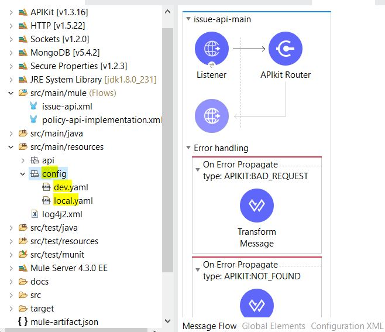
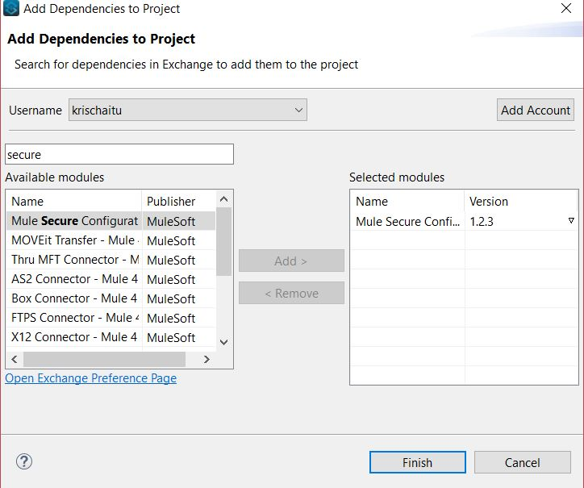
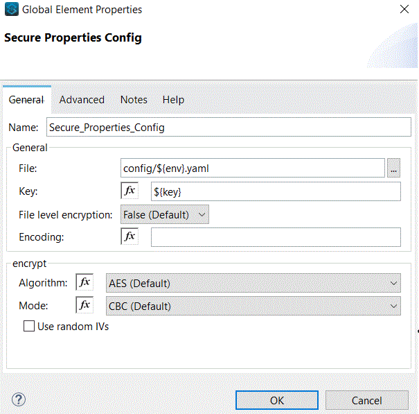

# Issue -API Configuration 
## Secure Properties in Mule 4

Properties in Mule 4 can be encrypted to keep our sensitive data like ClientID and Client Password. Secure property module provided by mulesoftWe can be used to encrypt a .yaml or .properties file. Generally, in properties files, we store information like Client ID, Secret, UserId, UserPassword, Splunk Tokens, Oauth Token, AWS Keys, etc. 

We need to encrypt the data inside any property files to restrict unauthorized access and to protect the data. 

Let�s discuss how to achieve this using MuleSoft's Secure Property in our Issue API.
Creating Secure Properties Is Done in Three Steps

1. Create a configuration properties file.

2. We can encrypt the whole file or encrypt individual property. For individual property, we can define secure properties in the file by enclosing the encrypted values between the sequence![value].

3. Configure the file in the project with the Mule Secure Configuration Properties Extension module dependency. The file must point to or include the decryption key.

 ## Create a Configuration Properties File

1. The first task in securing configuration properties is to create a YAML configuration file (.yaml) or a Spring-formatted Properties file (.properties), where you define the properties in src/main/resources in your Mule project. The Mule Secure Configuration Properties extension module enables you to configure YAML or Properties file types.

Refer to the below artifacts for more information.

Open Anypoint Studio -> Navigate to Issue-api project (right click & open Properties)-> Go to Project Folder -> src/main/resources ->  Create new folder (config) ->Select Create New file(File extension can be either .yaml or .properties)

The following dev.yaml , local.yaml file contains non-encrypted values. which has connectionString details.

 ## How to Define Secure Configuration Properties in The File.

## Encrypt Properties Using the Secure Properties Tool(jar):
Download Secure-properties-tool.jar from https://docs.mulesoft.com/downloads/mule-runtime/4.2/secure-properties-tool.jar and put it into any folder location. Put the unencrypted yaml file  like (local.yaml)in the same location and local-encrypted.yaml file ( just create an empty file).

Use the following syntax/cmd to encrypt or decrypt all the content of a properties file:

https://docs.mulesoft.com/mule-runtime/4.3/secure-configuration-properties read this for more info on the syntax

C:\secure-properties>java -cp secure-properties-tool.jar com.mulesoft.tools.SecurePropertiesTool file encrypt AES CBC 1234567812345678 c:\mulesoft\local.yaml "c:\mulesoft\local-encrypted.yaml"

## The Final Step Is Configuring Secure Property Module and Dependency in The Project

Add the secure property module in your project from mule palette , select from Exchange and configure the same. It can be downloaded from exchange also.

### Configure the File with the Extension Module in Studio

If you are developing applications using Anypoint Studio, you can also create secure configuration properties using the module by adding it as a dependency in your Mule app.

1. Install the Extension Module
2. Open your Mule project in Anypoint Studio.

3. Go to the Mule Palette section.

4. Click Search in Exchange.

5. In the Add Module to Project window, search for Mule Secure Configuration Property Extension in the Type a search term to look up in Exchange box.

6. Select the module name in the list.

7. Click Add and then Finish.

## Add and Configure Secure Configuration Properties to your App
Go to your Mule app configuration file.

Select Global Elements tab.

Click Create.

Select Secure Properties Config.

Configure the global element with a File location, Key, Algorithm, Mode, Use random IV, File level encryption, and Encoding.

Click OK.

## Verify Secure Configuration Properties at Development Time
When you are developing applications in Studio, you can verify that secure configurations properties for a connector are set up correctly by testing the connector connection.

The secure:: prefix is added before the property name definition, to enable access to all values inside a secure properties file, even if the values are not encrypted.

You can click Test Connection to verify that the connection is functioning as expected and assure that the secure properties are read successfully.
