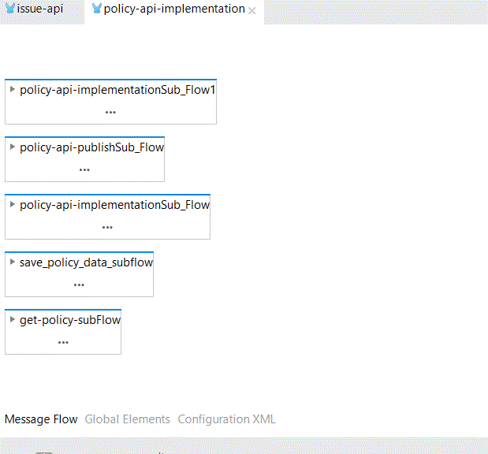
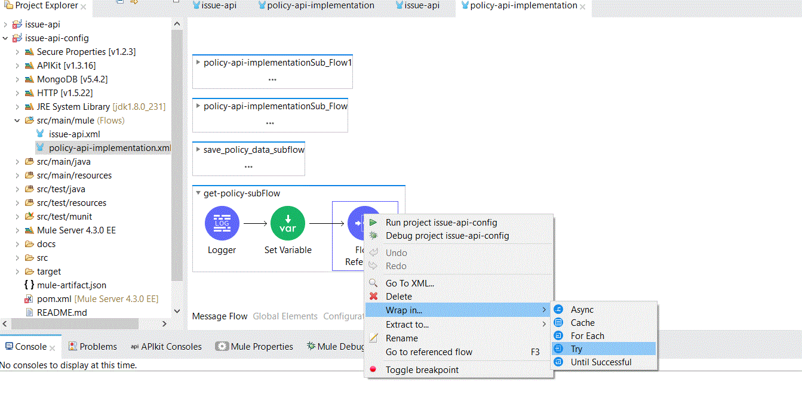
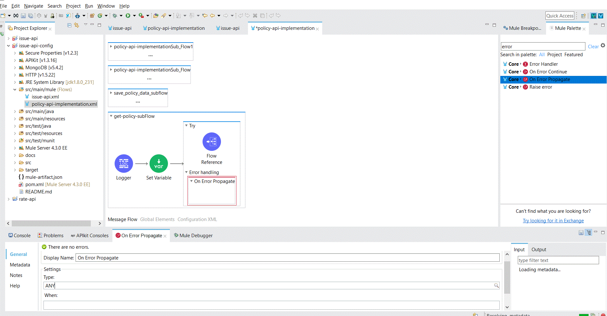
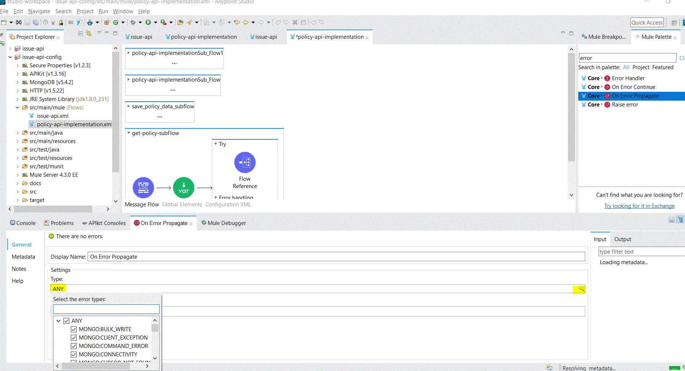
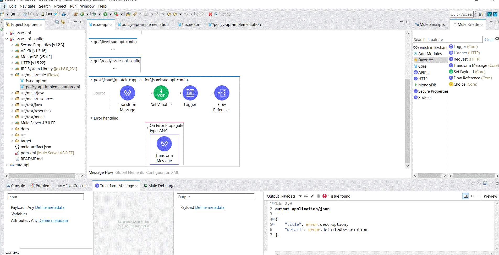
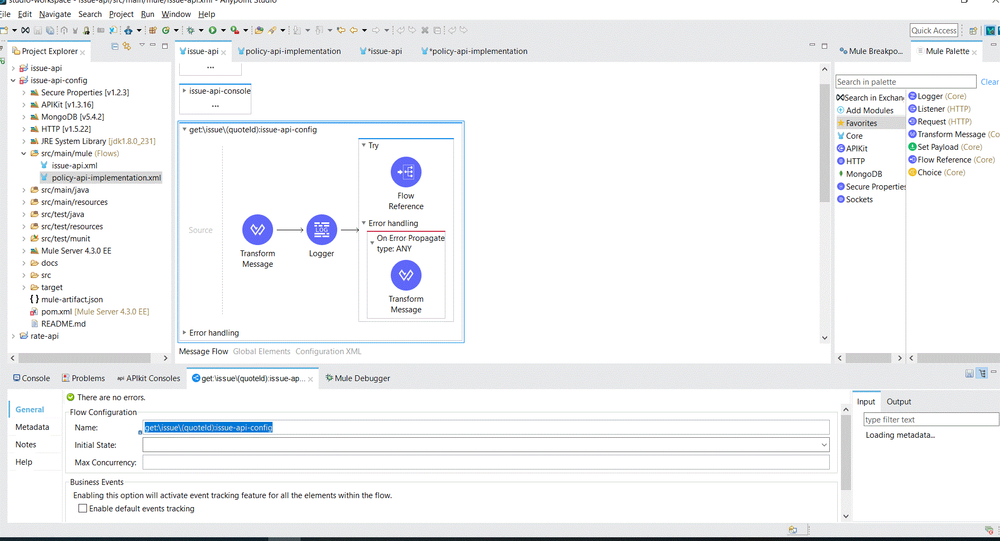
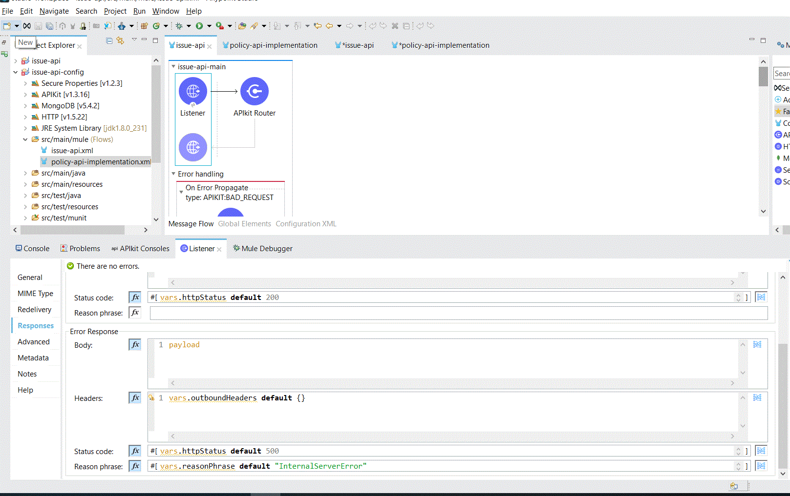
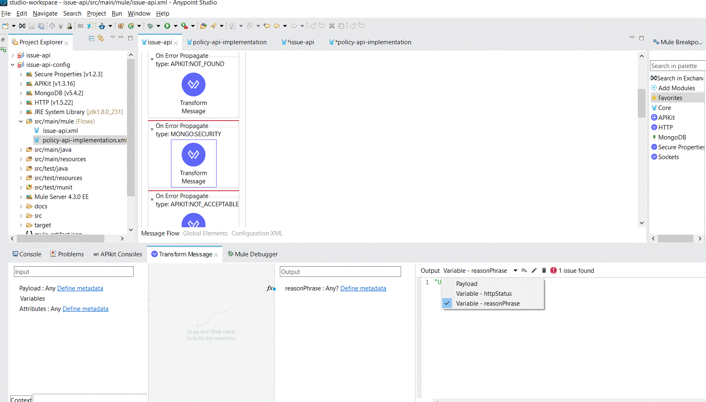
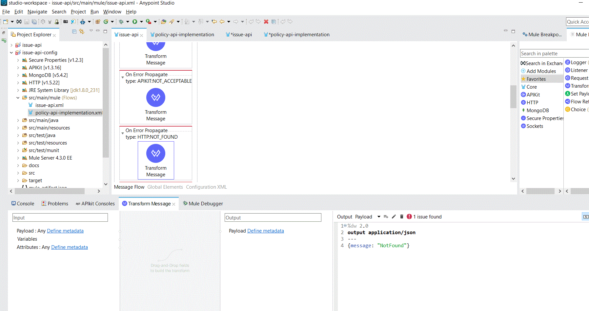

# Issue -API Error Handling
## Post Operation Implementation.xml

1. Checkout the issue-api repository from Git <https://github.com/ANE-UCD-MULESOFT-TRAINING/issue-api> and branch 3.configuration. 
  This would get the base code to start the development for this exercise. 
  Import the project into Anypoint Studio by selecting import project, Anypoint studio project. This would open the Mule Project inanypoint studio. 
  Once the project is open, Run the project to check if it loads correctly. This step should download all the dependencies required as well. 
  
  
2. Once the build is complete and you validate that the app is loading correctly, lets perform the next step of adding the modules required for this project.        
    1.Navigate to policy-api-implementation.xml. 
    
     
     
    2.Go to get-policy-subflow , wrap the flow into try-catch
    
    
    
    3.Once the flow is wrapped, navigate to mule paletter and search for error,
    4.Drag & drop -On error Propagate connector from mule palette to the flow (get-policy-sub-flow) into the catch block as shown below.
    
     
     
    5. Now, please set the error type in the on error propagate connector as 'ANY'
     
     
     
     6.Now, navigate back to mule palette and search for 'Transform Message', 
     7.drag & drop it into to on Error propagate connector as below and set the payload as shown in the screenshot
     
     
     
    8. Navigate to other sub flow save_policy_data_subflow and repeat the same steps as done for get-policy-sub-flow.
    
    9. Navigate to other sub flow policy-api-implementationSub_Flow and repeat the same steps as done for get-policy-sub-flow.
    
    10. Navigate to other sub flow policy-api-implementationSub_Flow1, wrap the Request call into try catch and repeat the same steps as done for get-policy-sub-flow 
    
   3. Navigate to issue-api.xml
    
    1. Navigate to post:\issue\(quoteId):application\json:issue-api-config route
    
    2. Navigate to mule palette and drag-drop on error propagate into the error -handling section of the flow as shown below.
    
        
    
    3. Now search for transform message in mule palette and drag it into error propagate section and update the payload as shown in screenshot     
    
    
    
    4.Perform the same steps for get:\issue\(quoteId):issue-api-config
     
     
    
    5. Navigate to issue-api-main flow in issue-api.xml
    6. Navigate to Listener and set the reason phrase as shown in the screenshot.
    
    
    
    7. Once done , navigate to each error type for e.g: APIKIT:BADREQUEST  and create two variables under transform message 
    
    8. Along with this update error type of  APIKIT:METHOD_NOT_ALLOWED as MONGO:SECURITY and also update error type of APIKIT:NOT_ACCEPTABLE as HTTP:NOT_FOUND
    
    1. vars.httpStatus (it might already be present)
    
    2. vars.reasonPhrase
    
    
    
    
    
    Now run the application and test.
 
